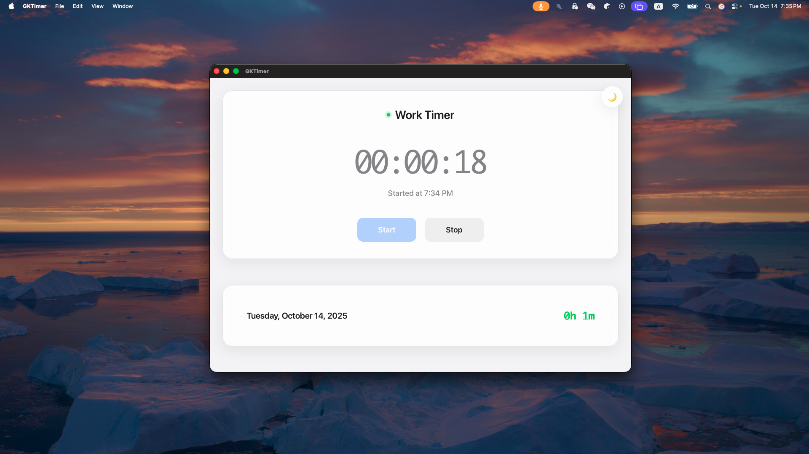

# GKTimer

A modern work timer application built with Tauri and Rust.

## Screenshots

### Light Mode


### Dark Mode


## Features

- ⏱️ Simple start/stop timer functionality
- 📊 Daily work time tracking
- 🌙 Dark/Light theme support
- 💾 Local data storage
- 🎨 Modern, clean UI

## Installation

### Prerequisites

- Rust (latest stable version)
- Node.js (for development)
- Tauri CLI

### Development

1. Clone the repository
2. Install dependencies:
   ```bash
   npm install
   ```
3. Run the development server:
   ```bash
   cargo tauri dev
   ```

### Building

```bash
cargo tauri build
```

## Data Storage

The application stores work session data in `~/.gktimer/work_sessions.json`. This file is automatically created when you first use the timer.

## Usage

1. Click "Start" to begin a work session
2. Click "Stop" to end the current session
3. View your daily work time in the bottom panel
4. Click on the daily work time to see detailed session breakdown
5. Use the theme toggle button (🌙/☀️) to switch between light and dark modes